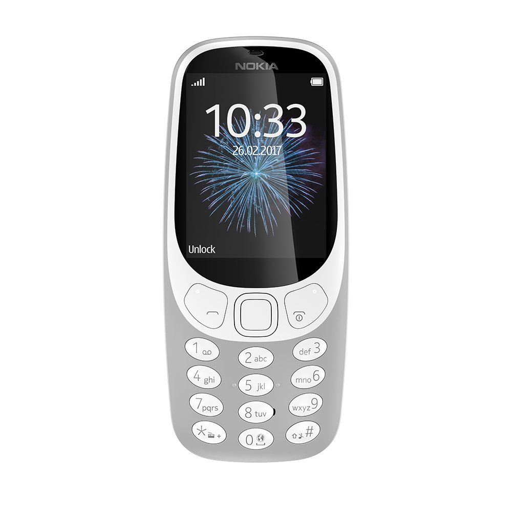

---

# Spotia3310 - Spotify Playlist Manager using Spotdl


Spotia3310 is a Python-based Spotify playlist manager that simplifies the process of downloading and organizing Spotify playlists on Dumbphones.

## Features

- **Download Playlists:** Use Spotdl to download Spotify playlists effortlessly.
- **Organize Playlists:** Automatically organize downloaded playlists into user-defined directories.
- **Command-line Interface:** Quickly manage playlists from the command line.

## Compatibility
Spotia3310 has been successfully tested on the following phone:

Nokia 2660 Flip Phone
If you have tested Spotia3310 on other dumbphones, feel free to contribute your findings!

## How to Use

### Installation

1. Ensure Spotdl is installed:
   ```bash
   pip install spotdl
   ```

2. Clone the repository:
   ```bash
   git clone https://github.com/Eiafuawn/spotia3310.git
   cd spotia3310
   ```

### Usage

Run the script with the following command:

```bash
python spotia -d /path/to/music/folder
```

- Use the `-d` or `--dirpath` argument to specify the target directory for downloads and playlist management.
- The way the Nokia 2660 flips works means that you can only have one playlist at a time if you don't manually add each song to the list which is horrendous.
- To remediate this spotia3310 archives the non-active playlist so yes you can only select one at a time for now (But you can manually unzip)
- The script automatically uses spotdl sync but I still need to add a simple way to sync. Normally if you just try to download it again it should still sync.

### Example

```bash
python spotia -d /music/downloads
```

## Note

- The script creates a folder for each downloaded playlist in the specified directory.
- If errors occur during the download process, the script will print error messages for further investigation.
- The project is quite niche but I think there's a growing population of dumbphone user in the dev community (Which is my case)

Feel free to contribute or report issues!

--- 
